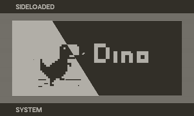

# Dino

This is a recreation of [Google Chrome's offline dinosaur game](https://www.rust-lang.org) on [Playdate](https://play.date).

The game is developed using the Rust programming language and is built upon [playdate-rs](https://github.com/rusty-crank/playdate-rs), a safe C-API binding for Rust. It serves as a showcase for the API binding, demonstrating its capabilities.

Available for free at [wenyuzhao.itch.io/dino](https://wenyuzhao.itch.io/dino).

# Getting Started

1. Install playdate sdk
2. `cargo install playdate-cli`
3. Clone this repo
4. `cargo playdate run`
